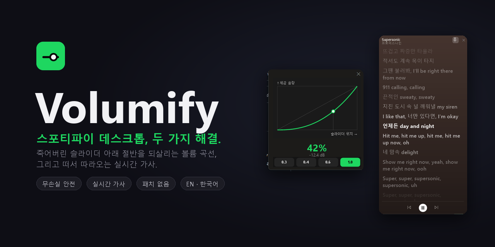

<div align="center">



<br>

[English](README.md) &nbsp;·&nbsp; **한국어**

<br>

[](#)
[](#)
[](#-안전한-설계)
[](LICENSE)

[](https://github.com/mangomandu/volumify/releases/latest)

**⬇️ 설치 없이 — 최신 `.exe` 받아서 바로 실행.**

</div>

---

스포티파이 데스크톱엔 매일 거슬리는 게 둘 있어요: 볼륨 슬라이더는 **위쪽에 쏠려** 있고(아래 절반은 거의 무음, `80 → 100%`는 절벽), 가사는 **창 전체를 덮었다가** 최소화하면 사라지죠. **Volumify**는 이 둘을 **스포티파이를 전혀 패치하지 않고** 고치는 작은 트레이 앱이에요:

- 🎚️ **진짜 쓸모 있는 볼륨 슬라이더** — 조절 가능한 거듭제곱 곡선이 **스포티파이 자체 볼륨**을 움직여서 슬라이더 전 구간이 의미 있어지고, 그 레벨이 **어디서나 동기화**돼요 (폰, Connect 스피커, Windows 믹서).
- 🎤 **떠서 따라오는 가사** — *플레이리스트를 둘러보는 중에도 떠 있는* 작은 실시간 가사 창. 한 줄씩 동기화 + 클릭 이동, 앨범 색 배경, 스포티파이가 보여주는 *그 가사 그대로*.

> 클라이언트 패치 없음 — **자동 업데이트에도 멀쩡하고 무손실(Lossless)도 그대로**, 그 레벨이 모든 기기로 따라가요.

## ✨ 미리보기

스포티파이의 **자체** 볼륨 슬라이더 위에 겹쳐요 — 창 크기가 바뀌어도 위치·너비가 맞춰지고, 옆 버튼은 안 가려요. 둘 중 아무거나 움직여도 **양방향으로** 같이 움직여요:

<div align="center"></div>

창이 좁아서 작은 레일을 잡기 힘들 땐? **올려놓으면 넉넉한 팝업**이 실시간 %와 함께 떠요:

<div align="center"></div>

## 🎯 작동 방식

슬라이더는 하나만 보이지만 앱이 그걸 다시 매핑해요. 위치 `x`(0–1)로 옮기면 **스포티파이 자체 볼륨**을 이렇게 설정해요:

```
gain = x ^ p
```

스포티파이 기본 곡선은 **위쪽에 쏠려** 있어요(≈ `x⁴`): 슬라이더를 한가운데 둬도 실제로는 **19%**밖에 안 들려요. `p`가 **1보다 작으면** 그 쏠림을 펴줘요 — 아래쪽이 끌어올려져 슬라이더 전체가 쓸모 있어지죠. **`p ≈ 0.4`**면 한가운데가 **약 50%**로 들려서 체감 음량이 슬라이더 위치를 그대로 따라가요(고름). `p = 1`은 스포티파이 원본 그대로(위쪽 쏠림), 더 키우면 오히려 나빠져요. 트레이나 패널의 **실시간 곡선 그래프**로 감으로 고르세요:

<div align="center"></div>

각 프리셋은 이미 아는 곡선을 **정확히 재현**해요 ("비슷하게"가 아니라):

| 프리셋 | 똑같음 | 느낌 |
|--------|--------|------|
| **리니어** · *Linear* | **웹 유튜브** — 진폭 선형 (*진짜* "리니어") | 초반부터 큼; 아래쪽이 예민 |
| **고름** · *Even* (**추천**) | 청감 스위트스폿 | 체감 음량이 슬라이더를 그대로 따라감 |
| **디스코드** · *Discord* | **디스코드 / 아이폰** — 로그 dB "오디오 테이퍼" | dB 단계가 균일; 낮은 음역 미세 조절 |
| **스포티파이** · *Spotify* | 스포티파이 원본 곡선 | 위쪽 쏠림 — Volumify가 푸는 그 문제 |

> 출발점일 뿐이니 취향껏 조절하세요. 설정되는 값이 스포티파이의 *진짜* 볼륨이라 내부는 아무것도 안 건드리고, 그 레벨이 모든 기기로 따라가요.

## 🎤 따라가는 가사

스포티파이 기본 가사는 창 전체를 덮어요 — 플레이리스트를 가리고, 최소화하면 사라지죠. **Volumify는 둘러보는 중에도 떠 있는 작은 실시간 가사 창**을 띄우고, 스포티파이엔 없는 것들을 더해요.

<div align="center"></div>

- **실시간 동기화 & 클릭 이동** — 줄이 실시간으로 하이라이트되고 자동 스크롤되며, 스포티파이처럼 **아무 줄이나 누르면 그 부분으로 이동**해요. 하이라이트는 *진짜* 실시간이에요 — 재생 위치를 외삽해서 줄이 한 박자 늦지 않고 **보컬과 같이** 켜져요.
- **스포티파이가 보여주는 그 가사 그대로** — 가사는 스포티파이가 라이선스하는 바로 그 데이터베이스 **Musixmatch**에서 와요. 선택적인 **읽기 전용 스포티파이 로그인**(한 번)으로 스포티파이가 띄우는 *정확히 그 버전*을 트랙 단위로 맞춰요. 안 해도 똑똑한 매칭으로 떠요. 잘 안 잡히는 곡 — 특히 한국 노래 — 은 **벅스·지니·Genius·LRCLIB를 병렬로 동시에** 돌려서 끝까지 찾아내요.
- **앨범 색 배경** — 스포티파이 'Now Playing'처럼 앨범 커버 색으로 배경을 물들여요. 트레이에서 켜고 끌 수 있어요.
- **고정 + 재생 컨트롤** — **📌 핀**으로 고정하면 스포티파이를 최소화해도 가사가 남아요. 고정 상태에선 **⏮ ⏯ ⏭** 가 떠서 스포티파이를 다시 안 띄우고도 곡을 넘기고 멈출 수 있어요 (Windows 미디어 컨트롤로 보내서 최소화 상태에서도 작동).
- **즉시 표시** — 다음 곡 가사를 미리 받아 디스크에 캐시해서, 곡이 바뀌면 거의 곧바로 떠요.
- **연주곡도 알아요** — 피아노/연주곡엔 엉뚱한 가사 대신 🎹🐈 가 떠요.
- **네 색깔로** — 기본은 스포티파이 그린, 코랄 프리셋, 또는 색상 코드/피커로 원하는 강조색.

| 가사 출처 | 역할 |
|-----------|------|
| **Musixmatch** | 주 소스 — 스포티파이가 쓰는 그 카탈로그. 로그인하면 *정확히* 일치 |
| **벅스 · 지니** | 한국 노래 줄 동기화 가사 |
| **Genius** | 일반 텍스트 폴백 |
| **LRCLIB** | 커뮤니티 줄 동기화 폴백 |

> 재생 중인 곡은 Windows 미디어 컨트롤에서 읽어요 — **패치는 절대 없어요.** 선택적 스포티파이 로그인은 *본인의* 무료 스포티파이 앱을 통한 **읽기 전용 '현재 재생 중'** 권한뿐이라 클라이언트를 건드리지 않고, 아예 안 써도 돼요.

## 🚀 기능

- 🎚️ **조절 가능한 청감 곡선** — **웹 유튜브**(리니어)·**청감 스위트스폿**(고름, 추천)·**디스코드/아이폰**의 로그 dB 테이퍼·**스포티파이** 원본 곡선을 *정확히* 재현하는 프리셋 + **실시간 곡선 그래프**.
- 🎤 **떠 있는 실시간 가사** — *둘러보는 중에도 위에 떠 있는* 가사 창. 클릭 이동, 앨범 색 배경, 핀 + 재생 컨트롤, 그리고 Musixmatch(스포티파이가 쓰는 카탈로그)의 *정확한* 가사까지. [자세히 ↑](#-따라가는-가사)
- 🔁 **양방향 동기화** — 스포티파이 자체 슬라이더(또는 미디어 키, 폰)를 움직이면 Volumify가 따라오고, Volumify를 움직이면 스포티파이가 따라와요. 항상 같이 움직여요.
- 📱 **모든 기기에 동기화** — 스포티파이 자체 볼륨을 움직이니 폰과 Connect 스피커도 함께 와요 (OS 전용 게인 아님).
- 🌐 **English & 한국어** — 첫 실행 때 Windows 언어를 자동 감지하고, 트레이에서 언제든 전환할 수 있어요.
- 🧲 **스포티파이에 붙는 두 가지 방식** — 따로 써도, 둘 다 켜도 돼요:
  - **오버레이** — 네이티브 레일 위에 얹히는 얇은 바 (초록 링으로 스포티파이 게 아니라 Volumify 것임을 표시). 레일이 너무 작아지면 뜨는 **호버 팝업** 옵션 포함.
  - **독 패널** — 곡선 패널이 스포티파이 창 옆에 붙어서 따라다녀요.
- 💾 **설정 기억** (`%APPDATA%\Volumify\settings.json`) + **Windows 시작 시 자동 실행** 옵션.
- 📦 **단일 자체 포함 `.exe`** — 설치 관리자도, 챙길 런타임도 없음.

## 🔒 안전한 설계

Volumify는 스포티파이 클라이언트를 절대 패치하지 않아요 — Windows UI 자동화로 스포티파이의 **자체** 볼륨 슬라이더를 바깥에서 살짝 움직일 뿐이에요. 그래서 스포티파이는 계속 자유롭게 업데이트해도 곡선은 그대로 동작하고, **무손실(Lossless)도 그대로**, 업데이트 후 다시 설치할 것도 없어요.

## 🛠️ 빌드 & 실행

> **그냥 쓰고 싶다면?** [`.exe` 다운로드](https://github.com/mangomandu/volumify/releases/latest) — 자체 포함이라 빌드 필요 없어요. 실행하면 트레이에 상주하면서 스포티파이 볼륨을 조절해줘요.
>
> _첫 실행:_ 서명이 안 된 오픈소스라(유료 인증서 없음) Windows SmartScreen이 경고할 수 있어요 — **추가 정보 → 실행**을 누르세요. **스마트 앱 제어**가 켜져 있으면(일부 새 Windows 11의 기본값) 서명 안 된 `.exe`는 아예 차단돼요 — "그래도 실행"이 없어요. 스마트 앱 제어를 끄거나(주의: 한 번 끄면 영구), 소스에서 빌드해(아래) MS 서명된 **.NET 호스트**로 실행하세요: `dotnet windows\bin\Release\net8.0-windows10.0.19041.0\Volumify.dll`.

Windows 앱은 [`windows/`](windows)에 있어요. 소스에서 빌드하려면 [.NET 8 SDK](https://dotnet.microsoft.com/download)가 필요해요:

```powershell
cd windows
dotnet build -c Release
.\bin\Release\net8.0-windows10.0.19041.0\Volumify.exe
```

<details>
<summary><b>단일 파일, 자체 포함 릴리스 (.exe, 의존성 없음)</b></summary>

```powershell
cd windows
dotnet publish -c Release -r win-x64 --self-contained `
  -p:PublishSingleFile=true -p:IncludeNativeLibrariesForSelfExtract=true `
  -p:EnableCompressionInSingleFile=true
```

독립 실행형 `Volumify.exe`는 `windows\bin\Release\net8.0-windows10.0.19041.0\win-x64\publish\`에 생겨요.
</details>

## 🧩 기술

C# / .NET 8 · WinForms (+ UI 자동화용 WPF) · Windows 믹서용 [NAudio](https://github.com/naudio/NAudio). **UI 자동화**가 스포티파이 네이티브 볼륨 슬라이더(RangeValue 패턴)를 움직이고, 양방향 동기화를 위해 다시 읽고, 오버레이 위치를 잡아요 — 로컬에서 변경당 ~1 ms, 클라이언트도 안 건드려요. **가사**는 Windows **SMTC** 미디어 컨트롤에서 재생 곡을 읽고 **Musixmatch**에서 가져와요(벅스/지니/Genius/LRCLIB를 폴백으로 병렬 실행). 볼륨 엔진은 Web API·OAuth를 안 쓰고, 유일한 선택적 로그인은 정확한 가사 매칭용 **읽기 전용** 스포티파이 로그인(PKCE)뿐이에요. 설계 노트, (고생해서 얻은) 오버레이 정렬 발견, 그리고 성능 픽스 정리(UI 자동화 오버레이가 어떻게 Chromium 앱(Spotify) CPU를 ~7% 태웠고 어떻게 추적·해결했는지)는 [`windows/FEATURES.md`](windows/FEATURES.md) 참고.

## 📄 라이선스

[MIT](LICENSE) — 마음대로 쓰세요.

<div align="center"><sub>스포티파이와 무관합니다. “Spotify”는 Spotify AB의 상표입니다.</sub></div>
