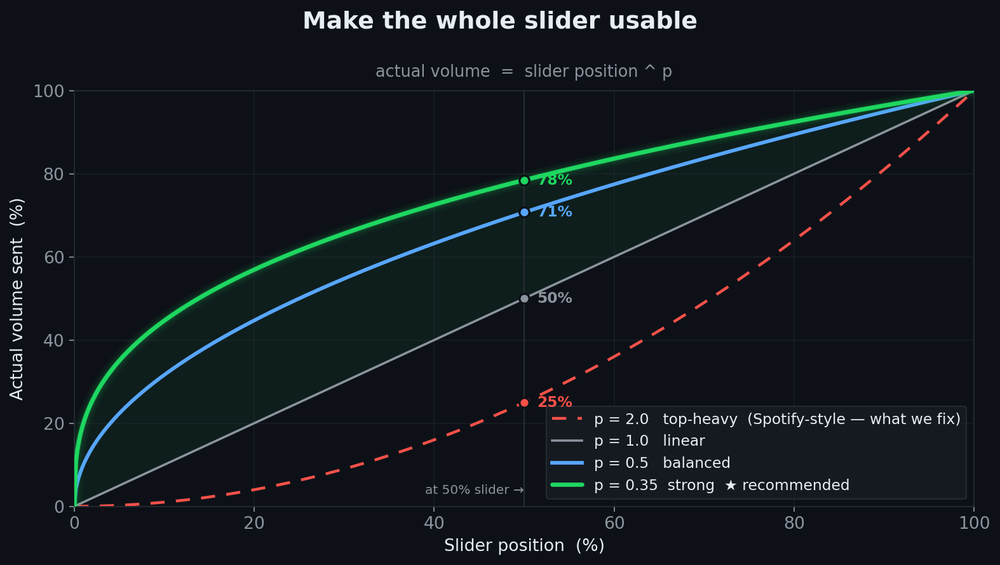
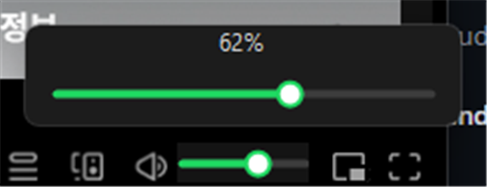

<div align="center">


# Spotify Volume Curve

### Spotify's volume slider, fixed.

**A perceptual, _linear‑feeling_ volume curve for Spotify on Windows — without ever touching the app.**

[](https://github.com/mangomandu/spotify-volume-curve/releases/latest)
[](#)
[](#)
[](#-why-not-just-spicetify)
[](LICENSE)

### [⬇️ Download the latest `.exe`](https://github.com/mangomandu/spotify-volume-curve/releases/latest) &nbsp;·&nbsp; no install, just run



</div>

---

Spotify Desktop's volume is **top‑heavy**: the bottom half of the slider does almost nothing, and `80 → 100%` is a cliff. This tiny tray app remaps it with a tunable power curve so **every part of the slider is useful** — by driving **Spotify's own volume** through Windows UI Automation. The level you land on is Spotify's *real* volume, so it **syncs everywhere** — your phone, Connect speakers, the Windows mixer — and the Spotify client is *never* patched.

> No Spicetify. No patching. **Survives auto‑updates. Keeps Spotify Lossless intact.** Syncs to your phone & Connect devices.

## ✨ See it

It overlays Spotify's **own** volume slider — matched to its position and width as the window resizes, and staying clear of the neighbouring buttons:

<div align="center"></div>

Window too narrow to drag the little rail? **Hover it for a roomy fly‑out** with a live %:

<div align="center"></div>

## 🎯 How it works

You see one slider; the app remaps it. Move it to position `x` (0–1) and it sets **Spotify's own volume** to:

```
gain = x ^ p
```

Spotify's built‑in curve is steep at the top (the bottom half barely moves), so a `p` **below 1** lifts the low end and the whole slider becomes usable. `p = 1` is the neutral baseline; higher `p` leans back toward Spotify's own top‑heavy feel. Pick by feel from the tray or the panel's **live curve graph**:

| preset | `p` | feel |
|--------|----:|------|
| **강하게** | 0.3 | most low‑end boost |
| **살짝 강하게** | 0.5 | gentler boost |
| **기준** | 1.0 | neutral baseline |
| **약하게** | 1.5 | closer to Spotify's stock curve |
| **스포티파이 디폴트** | 2.0 | Spotify's own top‑heavy default |

> These are starting points — tune to taste. Because the value it sets is Spotify's *real* volume, nothing inside Spotify is touched and the level follows you to every device.

## 🚀 Features

- 🎚️ **Tunable perceptual curve** — presets from *강하게 (0.3)* through *기준 (1.0)* to *스포티파이 디폴트 (2.0)*, with a **live curve graph**.
- 📱 **Syncs to every device** — it moves Spotify's own volume, so your phone and Connect speakers follow along (no separate OS‑only gain).
- 👁️ **Level shown everywhere** — the overlay, tray tooltip and control panel all reflect the current volume.
- 🧲 **Two ways to stick to Spotify** (pick one):
  - **Overlay** — a slim bar right on the native rail, with an optional **hover fly‑out** that appears only when the rail gets too small to drag.
  - **Compact dock** — a small panel that follows the Spotify window.
- 💾 **Remembers everything** (`%APPDATA%\SpotifyLinearVolume\settings.json`) and optional **run at startup**.
- 📦 **Single self‑contained `.exe`** — no installer, no runtime to chase.

## 🤔 Why not just Spicetify?

|  | Spicetify volume tweaks | **Spotify Volume Curve** |
|---|:---:|:---:|
| Survives Spotify auto‑updates | ❌ silently reverts each update | ✅ never touches Spotify |
| Works with **Lossless** | ⚠️ risky / can block it | ✅ completely untouched |
| Curve | hard‑coded `x²` | ✅ tunable + live graph |
| Setup | edit JS / run a CLI | ✅ run one `.exe` |

Because nothing inside Spotify is edited — the app only nudges Spotify's own volume slider from the outside — Spotify is free to update itself forever and your curve just keeps working.

## 🛠️ Build & run

> **Just want to use it?** [Download the `.exe`](https://github.com/mangomandu/spotify-volume-curve/releases/latest) — it's self‑contained, no build required. Run it and it lives in your tray, driving Spotify's volume for you.

To build from source you need the [.NET 8 SDK](https://dotnet.microsoft.com/download):

```powershell
dotnet build -c Release
.\bin\Release\net8.0-windows\SpotifyLinearVolume.exe
```

<details>
<summary><b>Single‑file, self‑contained release (.exe with no dependencies)</b></summary>

```powershell
dotnet publish -c Release -r win-x64 --self-contained `
  -p:PublishSingleFile=true -p:IncludeNativeLibrariesForSelfExtract=true `
  -p:EnableCompressionInSingleFile=true
```

The standalone `SpotifyLinearVolume.exe` lands in `bin\Release\net8.0-windows\win-x64\publish\`.
</details>

## 🧩 Tech

C# / .NET 8 · WinForms (+ WPF for UI Automation) · [NAudio](https://github.com/naudio/NAudio) for the Windows mixer. **UI Automation** drives Spotify's native volume slider (the RangeValue pattern) and locates it for the overlay — local, ~1 ms per change, no Web API or OAuth, and it never patches the client. See [`FEATURES.md`](FEATURES.md) for design notes and the (hard‑won) overlay‑alignment findings.

## 📄 License

[MIT](LICENSE) — do whatever you like.

<div align="center"><sub>Not affiliated with Spotify. “Spotify” is a trademark of Spotify AB.</sub></div>
