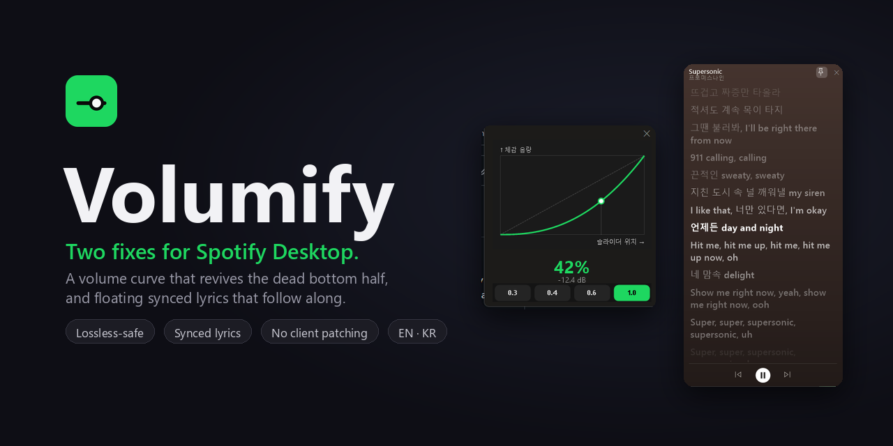

<div align="center">



<br>

**English** &nbsp;·&nbsp; [한국어](README.ko.md)

<br>

[](#)
[](#)
[](#-safe-by-design)
[](LICENSE)

[](https://github.com/mangomandu/volumify/releases/latest)

**⬇️ no install — just grab the latest `.exe` and run.**

</div>

---

Spotify Desktop has two everyday annoyances: its volume slider is **top‑heavy** (the bottom half does almost nothing; `80 → 100%` is a cliff), and its lyrics **take over the whole window** — then vanish the moment you minimize. **Volumify** is a tiny tray app that fixes both, **without ever patching Spotify**:

- 🎚️ **A volume slider that's actually usable** — a tunable power curve that drives Spotify's *own* volume, so every part of the slider counts and the level **syncs everywhere** (your phone, Connect speakers, the Windows mixer).
- 🎤 **Lyrics that float and follow** — a small synced window that **stays up while you browse playlists**, line‑synced and click‑to‑seek, tinted from the album art, with the *exact* words Spotify shows.

> No client patching — it **survives auto‑updates and keeps Spotify Lossless intact**, and the level follows you to every device.

## ✨ See it

It overlays Spotify's **own** volume slider — matched to its position and width as the window resizes, and clear of the neighbouring buttons. Nudge either bar and they move together, **both ways**:

<div align="center"></div>

Window too narrow to grab the little rail? **Hover it for a roomy fly‑out** with a live %:

<div align="center"></div>

## 🎯 How it works

You see one slider; the app remaps it. Move it to position `x` (0–1) and it sets **Spotify's own volume** to:

```
gain = x ^ p
```

Spotify's built‑in curve is **top‑heavy** (≈ `x⁴`): park the slider at the half‑way point and you only *hear* about **19%**. A `p` **below 1** flattens that out — it lifts the low end so the whole slider becomes usable. At **`p ≈ 0.4`** the half‑way point sounds like **~50%**, so loudness tracks right where you put the slider; `p = 1` is Spotify's raw top‑heavy default, and higher only makes it worse. Pick by feel from the tray or the panel's **live curve graph**:

<div align="center"></div>

Each preset reproduces a curve you already know — the maths is exact, not "close":

| preset | matches | feel |
|--------|---------|------|
| **리니어** · *Linear* | **web YouTube** — amplitude‑linear (the *real* "linear") | loud early; touchy near the bottom |
| **고름** · *Even* (**recommended**) | the perceptual sweet spot | perceived loudness tracks the slider evenly |
| **디스코드** · *Discord* | **Discord / iPhone** — a logarithmic dB "audio taper" | even in equal‑dB steps; fine control down low |
| **스포티파이** · *Spotify* | Spotify's own raw curve | top‑heavy — the problem Volumify fixes |

> Starting points — tune to taste. Because the value it sets is Spotify's *real* volume, nothing inside Spotify is touched and the level follows you to every device.

## 🎤 Lyrics that follow along

Spotify's own lyrics take over the whole window — they hide your playlist, and they're gone the moment you minimize. **Volumify floats a small synced‑lyrics window that stays put while you browse**, and adds a few things Spotify's doesn't.

<div align="center"></div>

- **Synced & click‑to‑seek** — lines highlight and auto‑scroll in real time, and you can **click any line to jump there**, just like Spotify. The highlight is *genuinely* real‑time: it extrapolates the playback clock so a line lights up *with* the vocal, not a beat behind it.
- **The exact lyrics Spotify shows** — words come from **Musixmatch**, the catalogue Spotify itself licenses. An optional, one‑time **read‑only Spotify login** pins the *exact* version Spotify displays (matched by track); skip it and it still resolves by smart matching. For the long tail — especially Korean songs — it **races Bugs, Genie, Genius and LRCLIB in parallel**, so niche tracks still land.
- **Album‑art tint** — the window tints its backdrop from the cover, like Spotify's Now Playing view. Toggle it from the tray.
- **Pin it + control playback** — **📌 pin** the window to keep it up when Spotify is minimized; pinned, it shows **⏮ ⏯ ⏭** so you can skip and pause without bringing Spotify back (routed through Windows' media controls, so it works while Spotify is hidden).
- **Instant** — it prefetches the next track's lyrics and caches them to disk, so the next song's words are up almost before it starts.
- **Knows an instrumental** — piano/instrumental tracks get a 🎹🐈 instead of a wrong guess.
- **Your colour** — Spotify green by default, a coral preset, or any custom hex / colour‑picker accent.

| where lyrics come from | role |
|------------------------|------|
| **Musixmatch** | primary — Spotify's own catalogue; *exact* match with the optional login |
| **Bugs · Genie** | Korean line‑synced lyrics |
| **Genius** | plain‑text fallback |
| **LRCLIB** | community line‑synced fallback |

> It reads *what's playing* from Windows' media controls — **no patching, ever**. The optional Spotify login is **read‑only "currently playing"** through your *own* free Spotify app; it never touches the client, and you can leave it off entirely.

## 🚀 Features

- 🎚️ **Tunable perceptual curve** — presets that *exactly* reproduce **web YouTube** (Linear), the **perceptual** sweet spot (Even, recommended), **Discord / iPhone**'s logarithmic dB taper, and **Spotify**'s raw curve — with a **live curve graph**.
- 🎤 **Floating synced lyrics** — a top‑of‑everything window that **stays up while you browse**, with click‑to‑seek, album‑art tint, a pin + playback controls, and the *exact* words from Musixmatch (the catalogue Spotify licenses). [More ↑](#-lyrics-that-follow-along)
- 🔁 **Two‑way sync** — move Spotify's own slider (or a media key, or your phone) and Volumify follows; move Volumify and Spotify follows. Everything stays in step.
- 📱 **Syncs to every device** — it moves Spotify's own volume, so your phone and Connect speakers come along (no separate OS‑only gain).
- 🌐 **English & 한국어** — auto‑detects your Windows language on first run; switch anytime from the tray.
- 🧲 **Two ways to ride along with Spotify** — use either, or both at once:
  - **Overlay** — a slim bar right on the native rail (a green ring marks it as Volumify's, not Spotify's), with an optional **hover fly‑out** that appears only when the rail gets too small to drag.
  - **Docked panel** — the curve panel snaps beside the Spotify window and follows it around.
- 💾 **Remembers everything** (`%APPDATA%\Volumify\settings.json`) and optional **run at startup**.
- 📦 **Single self‑contained `.exe`** — no installer, no runtime to chase.

## 🔒 Safe by design

Volumify never patches the Spotify client — it only nudges Spotify's **own** volume slider from the outside, through Windows UI Automation. So Spotify is free to update itself forever and your curve just keeps working, **Spotify Lossless stays intact**, and there's nothing to re‑install after an update.

## 🛠️ Build & run

> **Just want to use it?** [Download the `.exe`](https://github.com/mangomandu/volumify/releases/latest) — it's self‑contained, no build required. Run it and it lives in your tray, driving Spotify's volume for you.
>
> _First run:_ it's unsigned (open‑source, no paid certificate), so Windows SmartScreen may warn — click **More info → Run anyway**. With **Smart App Control** on (the default on some fresh Windows 11 installs) the unsigned `.exe` is blocked outright — there's no "run anyway". Either turn SAC off (note: that's permanent), or build from source (below) and launch it through the Microsoft‑signed **.NET host** instead: `dotnet windows\bin\Release\net8.0-windows10.0.19041.0\Volumify.dll`.

The Windows app lives in [`windows/`](windows). To build from source you need the [.NET 8 SDK](https://dotnet.microsoft.com/download):

```powershell
cd windows
dotnet build -c Release
.\bin\Release\net8.0-windows10.0.19041.0\Volumify.exe
```

<details>
<summary><b>Single‑file, self‑contained release (.exe with no dependencies)</b></summary>

```powershell
cd windows
dotnet publish -c Release -r win-x64 --self-contained `
  -p:PublishSingleFile=true -p:IncludeNativeLibrariesForSelfExtract=true `
  -p:EnableCompressionInSingleFile=true
```

The standalone `Volumify.exe` lands in `windows\bin\Release\net8.0-windows10.0.19041.0\win-x64\publish\`.
</details>

## 🧩 Tech

C# / .NET 8 · WinForms (+ WPF for UI Automation) · [NAudio](https://github.com/naudio/NAudio) for the Windows mixer. **UI Automation** drives Spotify's native volume slider (the RangeValue pattern), reads it back for two‑way sync, and locates it for the overlay — local, ~1 ms per change, and it never patches the client. **Lyrics** read the now‑playing track from Windows' **SMTC** media controls and fetch from **Musixmatch** (with Bugs / Genie / Genius / LRCLIB raced as fallbacks); the volume engine uses no Web API or OAuth, and the only optional sign‑in is a **read‑only** Spotify login (PKCE) that pins the exact lyric match. See [`windows/FEATURES.md`](windows/FEATURES.md) for design notes, the (hard‑won) overlay‑alignment findings, and a write‑up on the performance fix — why a UI‑Automation overlay can make a Chromium app (Spotify) burn ~7% CPU, and how it was traced and fixed.

## 📄 License

[MIT](LICENSE) — do whatever you like.

<div align="center"><sub>Not affiliated with Spotify. “Spotify” is a trademark of Spotify AB.</sub></div>
